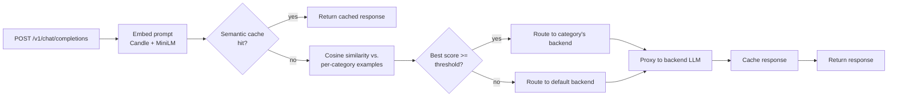

# semantic-router-rs

A "Mixture-of-Models" LLM router, written in Rust: it reads an incoming chat
prompt, figures out what kind of task it is (coding, math, creative writing,
business/legal, general chat) using local embedding similarity, and forwards
the request to whichever backend model handles that category best — all
without a training step, an ONNX runtime, or a Python inference dependency.

Inspired by [vllm-project/semantic-router](https://github.com/vllm-project/semantic-router).
This is a much smaller, from-scratch project built around the same core idea
(and the same choice of ML runtime — [Candle](https://github.com/huggingface/candle)),
not a port of its codebase.

## How it works



1. At startup, the router loads `config/routes.yaml`, embeds every example
   utterance for every category once with a local Candle BERT/MiniLM model,
   and keeps those vectors in memory.
2. Each request's latest user message is embedded the same way and compared
   by cosine similarity against every category's examples. The
   highest-scoring category above `confidence_threshold` wins; otherwise the
   request falls back to a configured default backend.
3. The request is proxied to that category's backend (`model` field
   rewritten), with `x-router-category` / `x-router-score` response headers
   so you can see the decision.
4. A brute-force semantic cache short-circuits near-duplicate prompts before
   they reach a backend at all.

Everything ML-related — tokenization, the BERT forward pass, mean pooling,
L2 normalization — runs in-process in Rust via
[Candle](https://github.com/huggingface/candle), HuggingFace's Rust tensor
library. No Python, no ONNX Runtime, no GPU required.

## Project layout

```
router/                  Rust service (axum + Candle)
  src/
    embeddings.rs          Candle MiniLM loading + sentence embedding
    routing.rs              cosine similarity + category selection
    cache.rs                 semantic response cache
    proxy.rs                 forwards requests to the routed backend
    server.rs                 axum HTTP layer
    config.rs                 routes.yaml schema/loader
  tests/integration_test.rs  end-to-end test against a mock backend
config/routes.example.yaml  category definitions + backend targets
eval/                     Python: labeled dataset + accuracy harness
```

## Quickstart

Requires the Rust toolchain and Python 3.11+.

```bash
# 1. Point categories at a backend. For local development, the included
#    mock backend just echoes back which model it received -- useful for
#    verifying routing decisions without any real LLM API keys.
cp config/routes.example.yaml config/routes.yaml
python -m venv .venv && .venv/bin/pip install -r eval/requirements.txt   # .venv\Scripts\pip on Windows
.venv/bin/python eval/mock_backend.py &                                  # .venv\Scripts\python.exe on Windows

# 2. Run the router (first run downloads ~90MB of MiniLM weights from the
#    Hugging Face Hub into the local HF cache).
ROUTER_CONFIG=config/routes.yaml cargo run --release

# 3. Try it.
curl "http://localhost:8088/route?q=Write+a+Python+function+to+sort+a+list"
curl http://localhost:8088/v1/chat/completions \
  -H 'content-type: application/json' \
  -d '{"messages":[{"role":"user","content":"Write a poem about the sea"}]}'
```

Or with Docker: `docker compose up --build` runs the router and mock
backend together (`docker-compose.yml`).

To point at real backends, edit `config/routes.yaml`: set each category's
`base_url` / `api_key_env` / `model` to a real OpenAI-compatible endpoint
(OpenAI itself, a local Ollama server, another gateway — anything that
speaks `/v1/chat/completions`).

> **Windows note:** if the router fails to bind with `os error 10013`, the
> port is likely blocked by Hyper-V's reserved range or antivirus/VPN
> software — pick a different `server.port` in the config.

## Evaluating routing accuracy

`eval/dataset.jsonl` is a 100-prompt, hand-labeled, held-out set (20 per
category, none of them reused as category examples). With the router and
mock backend running:

```bash
.venv/bin/python eval/run_eval.py --router-url http://localhost:8088
```

**Current result: 88% accuracy** (88/100) using pure embedding-similarity
routing with `all-MiniLM-L6-v2` and 12 example utterances per category — no
fine-tuning, no training data beyond the example sentences in
`routes.yaml`.

| Category | Precision | Recall | F1 |
|---|---|---|---|
| business_legal | 0.87 | 1.00 | 0.93 |
| coding | 1.00 | 0.70 | 0.82 |
| creative_writing | 0.90 | 0.90 | 0.90 |
| general_chat | 0.86 | 0.90 | 0.88 |
| math_reasoning | 0.82 | 0.90 | 0.86 |

Most of the remaining misses are genuinely ambiguous prompts that read as
belonging to more than one category ("What's the chi-squared test used
for?" landing in business_legal instead of math_reasoning). Doubling the
category example set from 6 to 12 utterances took accuracy from 71% to 88%
on this same held-out set — the biggest lever if you want to push further
is adding more/better examples in `routes.yaml`, not the model.

## Testing

```bash
cargo test
```

Runs unit tests (cosine similarity, category selection, cache eviction,
request parsing) plus an integration test that spins up a real Candle/MiniLM
embedder and a mock backend, and asserts prompts route to the correct
category end-to-end.

## What's here vs. what's not

This implements the core routing idea end-to-end and working: embedding
similarity routing, an OpenAI-compatible proxy, a semantic cache, and a
measured accuracy number. It does **not** implement the original project's
enterprise features — PII/jailbreak detection, a trained BERT classifier,
Kubernetes deployment, or streaming responses. Natural next steps, roughly
in order of effort:

- Streaming (SSE) passthrough for `/v1/chat/completions`
- Swap max-similarity routing for a small fine-tuned classifier
- Basic PII/jailbreak detection before proxying
- An HNSW index if the category/example count grows large
- A Kubernetes deployment manifest

## License

MIT — see [LICENSE](LICENSE).
