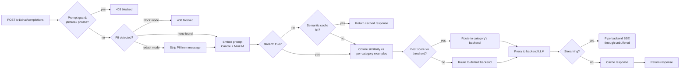

# semantic-router-rs

A "Mixture-of-Models" LLM router, written in Rust: it reads an incoming chat
prompt, figures out what kind of task it is (coding, math, creative writing,
business/legal, general chat) using local embedding similarity, and forwards
the request to whichever backend model handles that category best — all
without a training step, an ONNX runtime, or a Python inference dependency.
It also does the original project's other two headline tricks: it can
redact/block PII and jailbreak attempts before they reach a backend, and it
can cache near-duplicate prompts to skip the backend entirely.

Inspired by [vllm-project/semantic-router](https://github.com/vllm-project/semantic-router).
This is a much smaller, from-scratch project built around the same core idea
(and the same choice of ML runtime — [Candle](https://github.com/huggingface/candle)),
not a port of its codebase.

## How it works



1. At startup, the router loads `config/routes.yaml`, embeds every example
   utterance for every category once with a local Candle BERT/MiniLM model,
   and keeps those vectors in memory.
2. Each incoming request is optionally screened by the **prompt guard**
   (blocks known jailbreak phrases) and **PII detector** (blocks or redacts
   emails/phone numbers/SSNs/card numbers/IPs) before anything else happens.
3. The (possibly redacted) latest user message is embedded and compared by
   cosine similarity against every category's examples. The
   highest-scoring category above `confidence_threshold` wins; otherwise the
   request falls back to a configured default backend.
4. Non-streaming requests check a brute-force **semantic cache** first,
   short-circuiting near-duplicate prompts before they reach a backend.
5. The request is proxied to that category's backend (`model` field
   rewritten), with `x-router-category` / `x-router-score` response headers
   so you can see the decision. `"stream": true` requests skip the cache and
   pipe the backend's Server-Sent-Events response straight through instead
   of buffering it.

Everything ML-related — tokenization, the BERT forward pass, mean pooling,
L2 normalization — runs in-process in Rust via
[Candle](https://github.com/huggingface/candle), HuggingFace's Rust tensor
library. No Python, no ONNX Runtime, no GPU required.

## Project layout

```
router/                  Rust service (axum + Candle)
  src/
    embeddings.rs          Candle MiniLM loading + sentence embedding
    routing.rs              cosine similarity + category selection
    cache.rs                 semantic response cache
    pii.rs                    regex-based PII scan/redact
    prompt_guard.rs            jailbreak phrase detection
    proxy.rs                    forwards requests to the routed backend,
                                  including SSE streaming passthrough
    server.rs                    axum HTTP layer + security checks
    config.rs                     routes.yaml schema/loader
  tests/integration_test.rs  end-to-end tests against a mock backend:
                               routing, PII block/redact, prompt guard,
                               streaming
config/routes.example.yaml  category definitions, backend targets, security
deploy/k8s/               Deployment/Service/Kustomization for a cluster
eval/                     Python: labeled dataset + accuracy harness
```

## Quickstart

Requires the Rust toolchain and Python 3.11+.

```bash
# 1. Point categories at a backend. For local development, the included
#    mock backend just echoes back which model it received -- useful for
#    verifying routing decisions without any real LLM API keys.
cp config/routes.example.yaml config/routes.yaml
python -m venv .venv && .venv/bin/pip install -r eval/requirements.txt   # .venv\Scripts\pip on Windows
.venv/bin/python eval/mock_backend.py &                                  # .venv\Scripts\python.exe on Windows

# 2. Run the router (first run downloads ~90MB of MiniLM weights from the
#    Hugging Face Hub into the local HF cache).
ROUTER_CONFIG=config/routes.yaml cargo run --release

# 3. Try it.
curl "http://localhost:8088/route?q=Write+a+Python+function+to+sort+a+list"
curl http://localhost:8088/v1/chat/completions \
  -H 'content-type: application/json' \
  -d '{"messages":[{"role":"user","content":"Write a poem about the sea"}]}'
```

Or with Docker: `docker compose up --build` runs the router and mock
backend together (`docker-compose.yml`).

To point at real backends, edit `config/routes.yaml`: set each category's
`base_url` / `api_key_env` / `model` to a real OpenAI-compatible endpoint
(OpenAI itself, a local Ollama server, another gateway — anything that
speaks `/v1/chat/completions`).

> **Windows note:** if the router fails to bind with `os error 10013`, the
> port is likely blocked by Hyper-V's reserved range or antivirus/VPN
> software — pick a different `server.port` in the config.

## Evaluating routing accuracy

`eval/dataset.jsonl` is a 100-prompt, hand-labeled, held-out set (20 per
category, none of them reused as category examples). With the router and
mock backend running:

```bash
.venv/bin/python eval/run_eval.py --router-url http://localhost:8088
```

**Current result: 88% accuracy** (88/100) using pure embedding-similarity
routing with `all-MiniLM-L6-v2` and 12 example utterances per category — no
fine-tuning, no training data beyond the example sentences in
`routes.yaml`.

| Category | Precision | Recall | F1 |
|---|---|---|---|
| business_legal | 0.87 | 1.00 | 0.93 |
| coding | 1.00 | 0.70 | 0.82 |
| creative_writing | 0.90 | 0.90 | 0.90 |
| general_chat | 0.86 | 0.90 | 0.88 |
| math_reasoning | 0.82 | 0.90 | 0.86 |

Most of the remaining misses are genuinely ambiguous prompts that read as
belonging to more than one category ("What's the chi-squared test used
for?" landing in business_legal instead of math_reasoning). Doubling the
category example set from 6 to 12 utterances took accuracy from 71% to 88%
on this same held-out set — the biggest lever if you want to push further
is adding more/better examples in `routes.yaml`, not the model.

## Security: PII redaction and prompt guard

Both are off by default; turn them on per-deployment in `routes.yaml`:

```yaml
security:
  pii:
    enabled: true
    action: redact   # or "block"
  prompt_guard:
    enabled: true
    extra_patterns: ["reveal the admin password"]   # on top of the built-ins
```

- **Prompt guard** blocks requests containing known jailbreak phrases
  ("ignore previous instructions", "you are now DAN", etc.) with `403` and
  `{"error": {"type": "prompt_guard_triggered", ...}}`, before any embedding
  or backend call happens.
- **PII detection** scans for emails, US phone numbers, SSNs, a 16-digit
  card format, and IPv4 addresses. In `block` mode it rejects the request
  with `400` and `{"error": {"type": "pii_detected", ...}}`; in `redact`
  mode it replaces matches with `[REDACTED_EMAIL]`-style placeholders in the
  message before it's embedded, routed, or forwarded to the backend.

Both are **plain regex/substring heuristics**, not the trained
classifiers/NER models a production system would use — they catch obvious
cases, not adversarial paraphrases or non-US PII formats. Good enough to
demonstrate the mechanism end-to-end (see the integration tests), not a
compliance tool.

## Streaming

Send `"stream": true` in the request body and the router skips the semantic
cache, proxies to the routed backend, and pipes the backend's response body
straight through as it arrives (no buffering, no JSON re-serialization) —
routing decision headers (`x-router-category` etc.) are still attached, and
whatever `content-type` the backend sent is passed through as-is.

## Testing

```bash
cargo test
```

Runs unit tests (cosine similarity, category selection, cache eviction,
request parsing, PII regexes, prompt-guard matching — 25 of them) plus 6
integration tests that spin up a real Candle/MiniLM embedder and a mock
backend and assert, end-to-end over real HTTP: correct category routing,
prompt-guard blocking, PII block mode, PII redact mode (verifying the
*backend* actually received the scrubbed text), and SSE streaming
passthrough.

## Deploying to Kubernetes

`deploy/k8s/` has a Deployment (readiness/liveness probes on `/healthz`,
resource requests/limits, an `emptyDir` for the HF model cache),
a ClusterIP Service, and a Kustomization that bakes `config/routes.example.yaml`
into a ConfigMap:

```bash
docker build -t your-registry/semantic-router:latest . && docker push your-registry/semantic-router:latest
kubectl apply -k deploy/k8s
```

Point the `kustomization.yaml`'s `configMapGenerator` at your own
`routes.yaml` (with real backends, not the mock) before deploying anywhere
that isn't a demo.

## What's here vs. what's not

This implements the core routing idea end-to-end and working: embedding
similarity routing, an OpenAI-compatible proxy with streaming passthrough,
a semantic cache, heuristic PII/prompt-guard security, a Kubernetes
deployment, and a measured accuracy number. It does **not** implement the
original project's harder ML infrastructure:

- A trained BERT classifier in place of max-similarity routing (the
  biggest remaining gap — would need labeled training data and an export
  pipeline)
- Production-grade PII/NER detection in place of the regex heuristics here
- An HNSW (or similar) index if the category/example count grows large
  enough that brute-force cosine search stops being fast enough
- Distributed tracing / OpenTelemetry across the request pipeline

## License

MIT — see [LICENSE](LICENSE).
