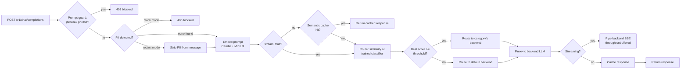

# semantic-router-rs

A "Mixture-of-Models" LLM router, written in Rust: it reads an incoming chat
prompt, figures out what kind of task it is (coding, math, creative writing,
business/legal, general chat), and forwards the request to whichever backend
model handles that category best. Two routing strategies ship side by side —
zero-training embedding similarity, and a trained linear classifier that
beat it in measurement (94% vs. 88% held-out accuracy, see below) — plus PII
redaction/blocking, jailbreak detection, a semantic cache, SSE streaming
passthrough, and OpenTelemetry tracing across the whole pipeline. All of it
runs as one Rust binary; no Python, ONNX runtime, or GPU at inference time.

Inspired by [vllm-project/semantic-router](https://github.com/vllm-project/semantic-router).
This is a much smaller, from-scratch project built around the same core idea
(and the same choice of ML runtime — [Candle](https://github.com/huggingface/candle)),
not a port of its codebase.

## How it works



1. At startup, the router loads `config/routes.yaml`, embeds every example
   utterance for every category once with a local Candle BERT/MiniLM model,
   and keeps those vectors in memory.
2. Each incoming request is optionally screened by the **prompt guard**
   (blocks known jailbreak phrases) and **PII detector** (blocks or redacts
   emails/phone numbers/SSNs/card numbers/IPs) before anything else happens.
3. The (possibly redacted) latest user message is embedded, then routed by
   whichever strategy `routing.strategy` selects: cosine similarity against
   every category's examples, or a trained linear classifier over the same
   embedding. The winning category above `confidence_threshold` wins;
   otherwise the request falls back to a configured default backend.
4. Non-streaming requests check a brute-force **semantic cache** first,
   short-circuiting near-duplicate prompts before they reach a backend.
5. The request is proxied to that category's backend (`model` field
   rewritten), with `x-router-category` / `x-router-score` response headers
   so you can see the decision. `"stream": true` requests skip the cache and
   pipe the backend's Server-Sent-Events response straight through instead
   of buffering it.

Everything ML-related — tokenization, the BERT forward pass, mean pooling,
L2 normalization — runs in-process in Rust via
[Candle](https://github.com/huggingface/candle), HuggingFace's Rust tensor
library. No Python, no ONNX Runtime, no GPU required.

## Project layout

```
router/                  Rust service (axum + Candle)
  src/
    embeddings.rs          Candle MiniLM loading + sentence embedding
    routing.rs              similarity router + RoutingStrategy enum
    classifier.rs             trained linear-probe inference
    cache.rs                    semantic response cache
    pii.rs                       regex-based PII scan/redact
    prompt_guard.rs                jailbreak phrase detection
    proxy.rs                        forwards requests to the routed backend,
                                      including SSE streaming passthrough
    server.rs                        axum HTTP layer, security checks,
                                       per-stage tracing spans
    config.rs                          routes.yaml schema/loader
    telemetry.rs                        console logging + optional OTLP
                                          trace export
  tests/integration_test.rs  end-to-end tests against a mock backend:
                               both routing strategies, PII block/redact,
                               prompt guard, streaming
config/
  routes.example.yaml     category definitions, backend targets, security
  classifier.json           trained weights (eval/train_classifier.py)
deploy/k8s/               Deployment/Service/Kustomization for a cluster
eval/                     Python: labeled dataset, accuracy harness,
                           classifier trainer, mock backend
```

## Quickstart

Requires the Rust toolchain and Python 3.11+.

```bash
# 1. Point categories at a backend. For local development, the included
#    mock backend just echoes back which model it received -- useful for
#    verifying routing decisions without any real LLM API keys.
cp config/routes.example.yaml config/routes.yaml
python -m venv .venv && .venv/bin/pip install -r eval/requirements.txt   # .venv\Scripts\pip on Windows
.venv/bin/python eval/mock_backend.py &                                  # .venv\Scripts\python.exe on Windows

# 2. Run the router (first run downloads ~90MB of MiniLM weights from the
#    Hugging Face Hub into the local HF cache).
ROUTER_CONFIG=config/routes.yaml cargo run --release

# 3. Try it.
curl "http://localhost:8088/route?q=Write+a+Python+function+to+sort+a+list"
curl http://localhost:8088/v1/chat/completions \
  -H 'content-type: application/json' \
  -d '{"messages":[{"role":"user","content":"Write a poem about the sea"}]}'
```

Or with Docker: `docker compose up --build` runs the router and mock
backend together (`docker-compose.yml`).

To point at real backends, edit `config/routes.yaml`: set each category's
`base_url` / `api_key_env` / `model` to a real OpenAI-compatible endpoint
(OpenAI itself, a local Ollama server, another gateway — anything that
speaks `/v1/chat/completions`).

> **Windows note:** if the router fails to bind with `os error 10013`, the
> port is likely blocked by Hyper-V's reserved range or antivirus/VPN
> software — pick a different `server.port` in the config.

## Evaluating routing accuracy

`eval/dataset.jsonl` is a 100-prompt, hand-labeled, held-out set (20 per
category, none of them reused as category examples). With the router and
mock backend running:

```bash
.venv/bin/python eval/run_eval.py --router-url http://localhost:8088
```

### Similarity routing (`routing.strategy: similarity`, the default)

**88% accuracy** (88/100) using pure embedding-similarity routing with
`all-MiniLM-L6-v2` and 12 example utterances per category — no training
data beyond the example sentences already in `routes.yaml`.

| Category | Precision | Recall | F1 |
|---|---|---|---|
| business_legal | 0.87 | 1.00 | 0.93 |
| coding | 1.00 | 0.70 | 0.82 |
| creative_writing | 0.90 | 0.90 | 0.90 |
| general_chat | 0.86 | 0.90 | 0.88 |
| math_reasoning | 0.82 | 0.90 | 0.86 |

Doubling the category example set from 6 to 12 utterances took accuracy
from 71% to 88% on this same held-out set — the biggest lever for this
strategy is adding more/better examples in `routes.yaml`, not the model.

### Trained classifier (`routing.strategy: classifier`)

`eval/train_classifier.py` trains a logistic-regression probe on the exact
same 60 example sentences (12 × 5 categories) similarity routing uses —
calling the router's own `/embed` endpoint so there's only one embedding
implementation in the whole project, never a second copy re-derived in
Python. Getting this to work well took two real fixes, worth keeping for
the story:

1. **First attempt: 7% accuracy** (worse than random). 60 examples in 384
   dimensions is badly underdetermined; `LogisticRegression`'s default
   regularization (`C=1.0`) fits the training set perfectly (100% train
   accuracy) but is nearly random on anything it hasn't seen. Switched to
   `LogisticRegressionCV` (5-fold CV *within the training examples*, never
   touching the held-out eval set) to pick the regularization strength
   properly — **63% accuracy**, and every remaining miss was the classifier
   correctly declining to guess (100% precision on every real category, just
   low recall from an over-conservative `confidence_threshold: 0.35`
   carried over from similarity routing's cosine-similarity scale).
2. Since the failure mode was purely "under-confident, never wrong,"
   lowering `confidence_threshold` to `0.25` (still comfortably above the
   1-in-5 = 0.20 random baseline) was the obvious next move: **94%
   accuracy**, beating similarity routing.

| Category | Precision | Recall | F1 |
|---|---|---|---|
| business_legal | 1.00 | 0.95 | 0.97 |
| coding | 1.00 | 0.85 | 0.92 |
| creative_writing | 0.90 | 0.95 | 0.93 |
| general_chat | 0.95 | 0.95 | 0.95 |
| math_reasoning | 1.00 | 1.00 | 1.00 |

The trained `config/classifier.json` is committed, so `routing.strategy:
classifier` works immediately without retraining — but it's specific to the
category set it was trained on. If you edit `categories` in `routes.yaml`,
retrain before switching to classifier mode:

```bash
.venv/bin/python eval/train_classifier.py --router-url http://localhost:8088
```

Similarity routing stays the default despite the lower score: it adapts to
config changes for free, with no separate training/export step and no risk
of a stale model silently mismatching the current category list.

## Security: PII redaction and prompt guard

Both are off by default; turn them on per-deployment in `routes.yaml`:

```yaml
security:
  pii:
    enabled: true
    action: redact   # or "block"
  prompt_guard:
    enabled: true
    extra_patterns: ["reveal the admin password"]   # on top of the built-ins
```

- **Prompt guard** blocks requests containing known jailbreak phrases
  ("ignore previous instructions", "you are now DAN", etc.) with `403` and
  `{"error": {"type": "prompt_guard_triggered", ...}}`, before any embedding
  or backend call happens.
- **PII detection** scans for emails, US phone numbers, SSNs, a 16-digit
  card format, and IPv4 addresses. In `block` mode it rejects the request
  with `400` and `{"error": {"type": "pii_detected", ...}}`; in `redact`
  mode it replaces matches with `[REDACTED_EMAIL]`-style placeholders in the
  message before it's embedded, routed, or forwarded to the backend.

Both are **plain regex/substring heuristics**, not the trained
classifiers/NER models a production system would use — they catch obvious
cases, not adversarial paraphrases or non-US PII formats. Good enough to
demonstrate the mechanism end-to-end (see the integration tests), not a
compliance tool.

## Streaming

Send `"stream": true` in the request body and the router skips the semantic
cache, proxies to the routed backend, and pipes the backend's response body
straight through as it arrives (no buffering, no JSON re-serialization) —
routing decision headers (`x-router-category` etc.) are still attached, and
whatever `content-type` the backend sent is passed through as-is.

## Observability: OpenTelemetry tracing

Structured console logging (`RUST_LOG=info`, `tracing_subscriber`) always
works. Set `OTEL_EXPORTER_OTLP_ENDPOINT` and the router additionally exports
spans over OTLP/HTTP — every request becomes one trace with per-stage
timing (`tower_http::trace::TraceLayer` for the HTTP-level span, then
nested `prompt_guard` / `pii_scan` / `embed` / `cache_lookup` / `route` /
`proxy_backend_call` spans inside it), matching the original project's
"fine-grained visibility into the request processing pipeline" feature.
It's best-effort: an unreachable collector logs a warning at startup and
the router runs exactly as normal, tracing just doesn't leave the process.

```bash
docker compose up --build   # now also starts Jaeger
```

Then open **http://localhost:16686**, pick the `semantic-router` service,
and look at a trace for any request you've sent — the security/embed/cache/
route/backend breakdown is right there per-span. Outside Docker: run
`docker run -p 16686:16686 -p 4318:4318 jaegertracing/all-in-one:latest`
and `export OTEL_EXPORTER_OTLP_ENDPOINT=http://localhost:4318` before
`cargo run`.

## Testing

```bash
cargo test
```

29 unit tests (cosine similarity, category selection, cache eviction,
request parsing, PII regexes, prompt-guard matching, classifier math) plus
7 integration tests that spin up a real Candle/MiniLM embedder and a mock
backend and assert, end-to-end over real HTTP: correct category routing
under *both* routing strategies (including against the actual committed
`classifier.json`, so a stale/broken weights file fails CI), prompt-guard
blocking, PII block mode, PII redact mode (verifying the *backend* actually
received the scrubbed text), and SSE streaming passthrough.

`.github/workflows/ci.yml` runs `cargo fmt --check`, `cargo clippy --all-targets
-- -D warnings`, and the full test suite above on every push/PR (plus a
syntax check over the eval scripts).

## Deploying to Kubernetes

`deploy/k8s/` has a Deployment (readiness/liveness probes on `/healthz`,
resource requests/limits, an `emptyDir` for the HF model cache),
a ClusterIP Service, and a Kustomization that bakes `config/routes.example.yaml`
into a ConfigMap:

```bash
docker build -t your-registry/semantic-router:latest . && docker push your-registry/semantic-router:latest
kubectl apply -k deploy/k8s
```

Point the `kustomization.yaml`'s `configMapGenerator` at your own
`routes.yaml` (with real backends, not the mock) before deploying anywhere
that isn't a demo. Set `OTEL_EXPORTER_OTLP_ENDPOINT` on the container if
your cluster already runs an OTLP collector.

## What's here vs. what's not

This implements the core routing idea end-to-end and working, both ways:
zero-training embedding similarity *and* a trained linear classifier that
beats it, an OpenAI-compatible proxy with streaming passthrough, a semantic
cache, heuristic PII/prompt-guard security, OpenTelemetry tracing, a
Kubernetes deployment, and measured accuracy numbers for both routing
strategies. It does **not** implement the original project's remaining,
harder infrastructure:

- A full transformer classifier (fine-tuned BERT) in place of the linear
  probe here — the linear probe already outperforms similarity routing on
  this task, but a fine-tuned model would likely generalize further past
  60 training examples
- Production-grade PII/NER detection in place of the regex heuristics here
- An HNSW (or similar) index if the category/example count grows large
  enough that brute-force cosine search stops being fast enough

## License

MIT — see [LICENSE](LICENSE).
